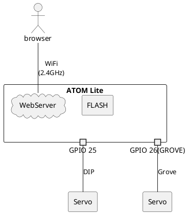

# Servo Web Controller

This project uses M5Atom to control servos. Operation is done through a web page.

## Project Status

<div style="display: flex">
    <div style="width:1em; background-color: red;margin-right:1em;"></div>
    <span style="">This project will not be refurbished unless requested.</span>
</div>


## Description

### parts list

| No. |          | Device type. | Device                |
| --- | -------- | ------------ | --------------------- |
| 1.  | Required | Board        | ATOM Lite             |
| 2.  | Required | Servo        | SG90 servo Compatible |


### System  diagram

The system is shown below.




## Wiring

Connect ATOM Lite and the servo according to the diagram below.


## Installation

* [TODO]
  * リリースフォルダにバイナリファイルを上げる必要があります。
リリースフォルダのbinファイルを格納してください。
  * バイナリでの書き込み方法
    * [Esptool.py Documentation](https://docs.espressif.com/projects/esptool/en/latest/esp32/)

```bash
# 動作例
esptool.py --port COM3 -b 1500000 write_flash 0x00000 firmware.bin
```


This system is compiled using PlatformIO. Please install the extension from VS Code's extension recommendations. If you want to know more, check [here](https://docs.platformio.org/en/latest/).


## Usage

- Boot in AP Mode for connection.
  - Perform WiFi configuration as needed.
- Servo operation is triggered by moving the slider.
- Press the sync button to simultaneously operate a separate connector (without synchronization).
  - Check the reversal checkbox to enable reverse operation.
- Press the MAX button to set it to the same value as the limit(max).
- Press the MIN button to set it to the same value as the limit(min).
- Press the RESET button to set it to the same value as the zero-point.
- Press the SAVE button to store the settings in a file. (Not yet implemented)
- Press the reattach button to reconnect with settings from ServoSetting.
- Press the default button to load settings saved on the microcontroller.


### Notes

* When you start it for the first time, it will operate in AP mode.
* You can join with the pass set in the definition "SETTING_WIFI_AP_DEFAULT_PASSWORD". [detail](https://github.com/MaSiRoProjectOSS/CushyWebServer#wifi-ap%E3%83%A2%E3%83%BC%E3%83%89%E6%8E%A5%E7%B6%9A%E8%A8%AD%E5%AE%9A)
* At startup, it connects to the servo but remains inactive. This is to avoid any potential issues that could arise from returning to the initial position upon restarting
* If you wish to modify the PIN for connection, you can redefine the value in the DEFINE section below.

| DEFINE          | Default value |
| --------------- | ------------- |
| SERVO_GROVE_PIN | 26            |
| SERVO_DIP_PIN   | 25            |

## Requirement

This system uses the following libraries.

* [m5stack/M5Atom](https://github.com/m5stack/M5Atom?utm_source=platformio&utm_medium=piohome)
* [fastled/FastLED](https://github.com/Makuna/NeoPixelBus?utm_source=platformio&utm_medium=piohome)
* [madhephaestus/ESP32Servo](https://www.arduinolibraries.info/libraries/esp32-servo)
* [MaSiRoProjectOSS/CushyWebServer](https://github.com/MaSiRoProjectOSS/CushyWebServer)
* [jQuery](https://jquery.com/)
  * jquery-3.7.0
* [roundSlider.js](https://roundsliderui.com/)
  * ver.1.6.1

## Changelog

It is listed [here](./Changelog).

## Support

Kindly provide the details by creating a new issue.

## Roadmap

Update irregularly.

<div style="display: flex">
    <div style="width:1em; background-color: red;margin-right:1em;"></div>
    <span style="">Next Update&nbsp;:&nbsp; </span>
    <span style="">No plans.</span>
</div>


## Contributing

We welcome pull requests from the community. If you're considering significant changes, we kindly ask you to begin by opening an issue to initiate a discussion about your proposed modifications.
Additionally, when submitting a pull request, please ensure that any relevant tests are updated or added as needed.

## Authors and acknowledgment

We offer heartfelt thanks to the open-source community for the invaluable gifts they've shared with us. The hardware, libraries, and tools they've provided have breathed life into our journey of development. Each line of code and innovation has woven a tapestry of brilliance, lighting our path. In this symphony of ingenuity, we find ourselves humbled and inspired. These offerings infuse our project with boundless possibilities. As we create, they guide us like stars, reminding us that collaboration can turn dreams into reality. With deep appreciation, we honor the open-source universe that nurtures us on this journey of discovery and growth.

## License

[MIT License](./LICENSE)

---

<!--
Apply styles when markdown
-->

<style>
  body {
    counter-reset: chapter;
}

h2 {
    counter-reset: sub-chapter;
}

h3 {
    counter-reset: section;
}

h4 {
    counter-reset: indexlist;
}

h1::before {
    counter-reset: chapter;
}

h2::before {
    counter-increment: chapter;
    content: counter(chapter) ". ";
}

h3::before {
    counter-increment: sub-chapter;
    content: counter(chapter) "-" counter(sub-chapter) ". ";
}

h4::before {
    counter-increment: section;
    content: counter(chapter) "-" counter(sub-chapter) "-" counter(section) ". ";
}

h5::before {
    counter-increment: indexlist;
    content: "(" counter(indexlist) ") ";
}

#sidebar-toc-btn {
    bottom: unset;
    top: 8px;
}

.markdown-preview.markdown-preview {
    h2 {
        border-bottom: 4px solid #eaecef;
    }

    h3 {
        border-bottom: 1px solid #eaecef;
    }
}

.md-sidebar-toc.md-sidebar-toc {
    padding-top: 40px;
}

#sidebar-toc-btn {
    bottom: unset;
    top: 8px;
}
</style>
