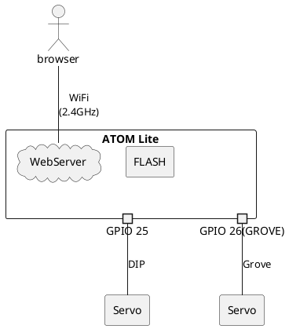

# Servo Web Controller

This project uses M5Atom to control servos. Operation is done through a web page.

## Project Status

    

    This project will not be refurbished unless requested.

## Description

### parts list

| No. |          | Device type. | Device                |
| --- | -------- | ------------ | --------------------- |
| 1.  | Required | Board        | ATOM Lite             |
| 2.  | Required | Servo        | SG90 servo Compatible |

### System  diagram

The system is shown below.

## Wiring

Connect ATOM Lite and the servo according to the diagram below.

## Installation

リリースフォルダのbinファイルを格納してください。

This system is compiled using PlatformIO. Please install the extension from VS Code's extension recommendations. If you want to know more, check [here](https://docs.platformio.org/en/latest/).

## Usage

TODO: Write usage instructions

## Requirement

This system uses the following libraries.

* [m5stack/M5Atom](https://github.com/m5stack/M5Atom?utm_source=platformio&utm_medium=piohome)
* [fastled/FastLED](https://github.com/Makuna/NeoPixelBus?utm_source=platformio&utm_medium=piohome)
* [madhephaestus/ESP32Servo](https://www.arduinolibraries.info/libraries/esp32-servo)
* [MaSiRoProjectOSS/CushyWebServer](https://github.com/MaSiRoProjectOSS/CushyWebServer)
* [jQuery](https://jquery.com/)
  * jquery-3.7.0
* [roundSlider.js](https://roundsliderui.com/)
  * ver.1.6.1

## Changelog

It is listed [here](./Changelog).

## Support

Kindly provide the details by creating a new issue.

## Roadmap

Update irregularly.

    

    Next Update&nbsp;:&nbsp; 
    No plans.

## Contributing

We welcome pull requests from the community. If you're considering significant changes, we kindly ask you to begin by opening an issue to initiate a discussion about your proposed modifications.
Additionally, when submitting a pull request, please ensure that any relevant tests are updated or added as needed.

## Authors and acknowledgment

We offer heartfelt thanks to the open-source community for the invaluable gifts they've shared with us. The hardware, libraries, and tools they've provided have breathed life into our journey of development. Each line of code and innovation has woven a tapestry of brilliance, lighting our path. In this symphony of ingenuity, we find ourselves humbled and inspired. These offerings infuse our project with boundless possibilities. As we create, they guide us like stars, reminding us that collaboration can turn dreams into reality. With deep appreciation, we honor the open-source universe that nurtures us on this journey of discovery and growth.

## License

[MIT License](./LICENSE)

